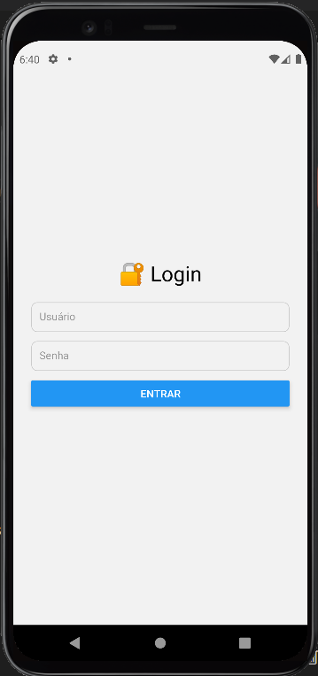
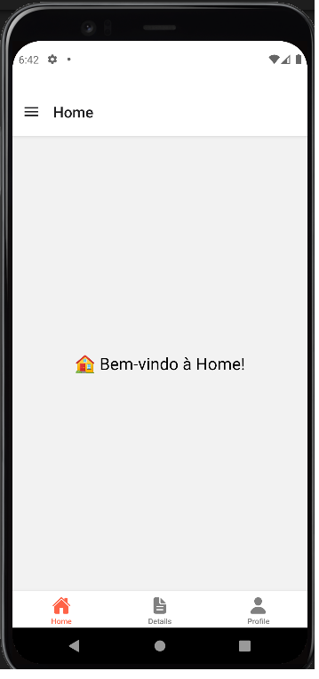
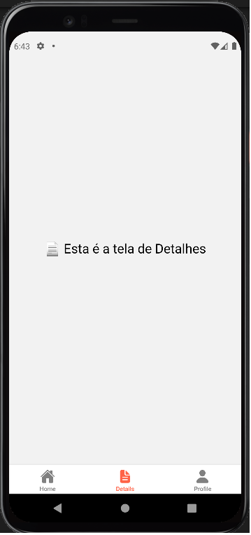
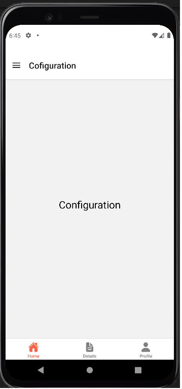
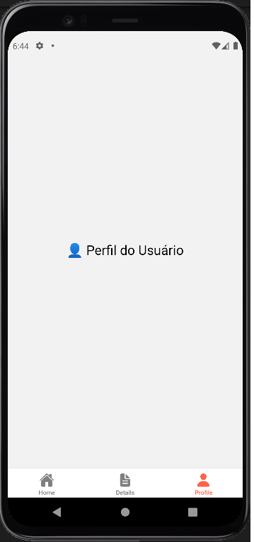

# ButtonTabApp

## 📋 Descrição

Este projeto foi desenvolvido como estudo de **Navegação em React Native**, utilizando:
- **Stack Navigator**
- **Bottom Tab Navigator**
- **Drawer Navigator**

O aplicativo demonstra a navegação entre diferentes telas com menus de abas e lateral (drawer).

---

## 🚀 Tecnologias Utilizadas

- [React Native](https://reactnative.dev/)
- [React Navigation](https://reactnavigation.org/)
- Expo (para facilitar o desenvolvimento e teste)

---

## ✅ Pré-requisitos

Antes de começar, você precisa ter instalado:
- [Node.js](https://nodejs.org/)
- [Expo CLI](https://docs.expo.dev/get-started/installation/)
- Um emulador Android/iOS ou um dispositivo real com o aplicativo **Expo Go**.

---

## 💾 Como Clonar ou Baixar o Projeto

Clone o repositório usando o comando:

```bash
git clone https://github.com/prof-rafaelcruz/buttontabapp.git
```

Ou faça o download do projeto clicando em **Code > Download ZIP** e extraia os arquivos.

---

## ⚙️ Instalação

1. Acesse a pasta do projeto:

```bash
cd buttontabapp
```

2. Instale as dependências:

```bash
npm install
```

3. Instale as bibliotecas de navegação necessárias:

```bash
npm install @react-navigation/native
npm install @react-navigation/native-stack
npm install @react-navigation/bottom-tabs
npm install @react-navigation/drawer
npm install react-native-screens react-native-safe-area-context react-native-gesture-handler react-native-reanimated
```

> ⚠️ Lembre-se de seguir a documentação do [React Navigation](https://reactnavigation.org/docs/getting-started) para configurar o projeto corretamente.

---

## ▶️ Como Rodar o Projeto

No terminal, execute:

```bash
npx expo start
```

Use o QR Code gerado para abrir o app no seu celular com o **Expo Go** ou rode no emulador.

---

## 🗂️ Estrutura de Pastas e Arquivos

```
buttontabapp/
├── assets/               # Recursos estáticos (imagens, ícones)
├── src/
│   ├── screens/          # Telas do aplicativo
│   │   ├── HomeScreen.js
│   │   ├── DetailsScreen.js
│   │   ├── SettingsScreen.js
│   │   └── ProfileScreen.js
│   └── navigation/       # Configuração dos Navigators
│       ├── StackNavigator.js
│       ├── BottomTabNavigator.js
│       └── DrawerNavigator.js
├── App.js                 # Arquivo principal do app
├── package.json           # Dependências do projeto
└── app.json               # Configurações do Expo
```

---

## 🧩 Sobre os Componentes e Telas

- **StackNavigator**: Gerencia a navegação entre as telas principais.
- **BottomTabNavigator**: Exibe abas na parte inferior para acesso rápido às telas.
- **DrawerNavigator**: Exibe um menu lateral para navegar entre as opções.

Cada tela (`HomeScreen`, `DetailsScreen`, `SettingsScreen`, `ProfileScreen`) é implementada como um componente React Native separado.

---

## 🖼️ Capturas de Tela

### LoginScreen


### HomeScreen


### DetailsScreen


### SettingsScreen


### ProfileScreen


> 💡 Para adicionar suas imagens: crie a pasta `assets/screenshots/` e salve as capturas com os nomes acima.

---

## 👤 Autor

- [prof-rafaelcruz](https://github.com/prof-rafaelcruz)

---
